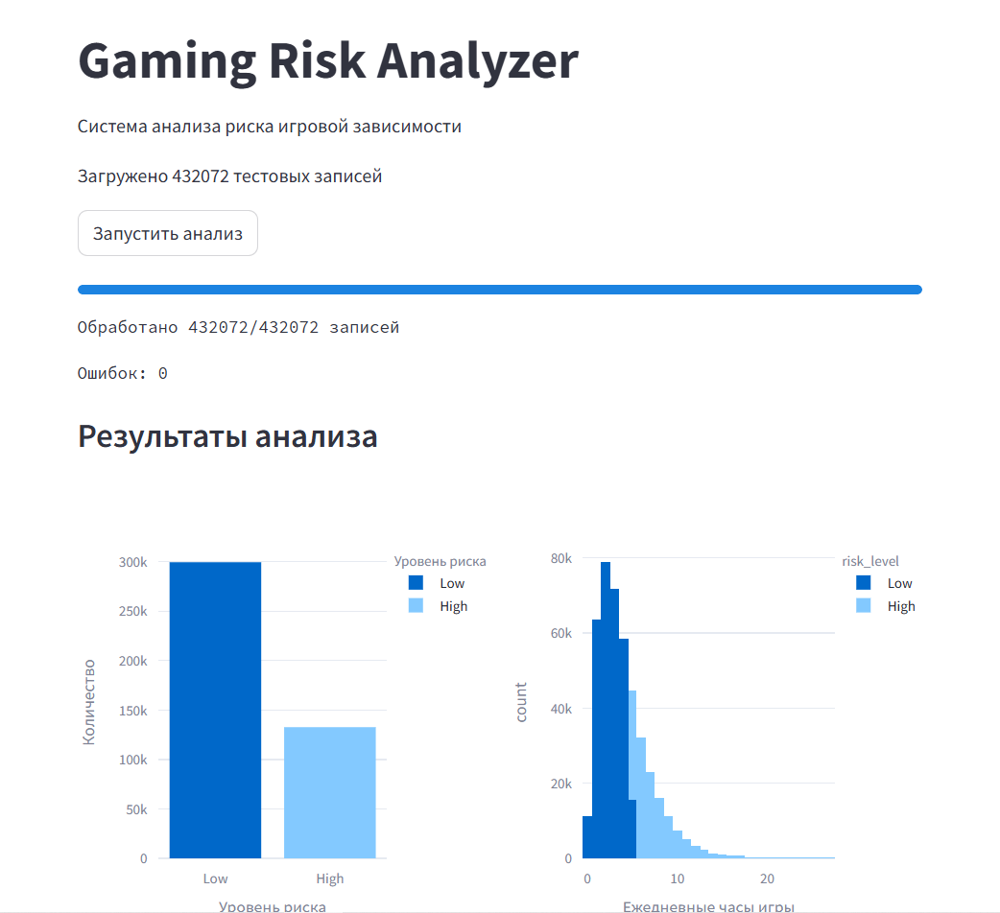
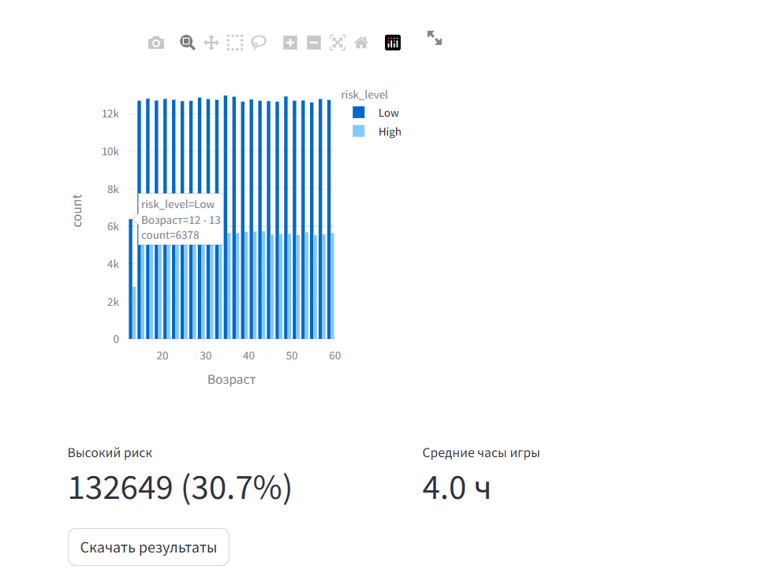

Данные `gaming_mental_health_10M_40features.csv` можно скачать тут https://www.kaggle.com/datasets/sharmajicoder/gaming-and-mental-health
# Установка и запуск

1. Клонируйте репозиторий

```bash
git clone https://github.com/aaklimovich/HW_1_Kafka.git

cd /HW_1_Kafka
```

2. Запустите проект
```bash
docker-compose up --build
```
3. Откройте в браузере: http://localhost:8501

4. Нажмите кнопку "Запустить анализ" для начала обработки данных



